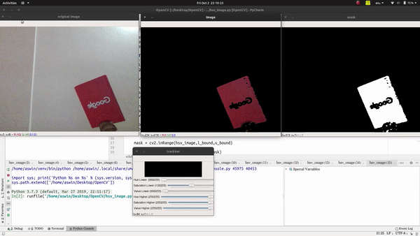

# HSV-Video-Segmentation
A basic Colour Segmentation for Live Video using HSV Channels.

The window "Trackbar" is used to set the Hue,Saturation and Value Upper Bound and Lower Bound values to detect color segments of our choice.
